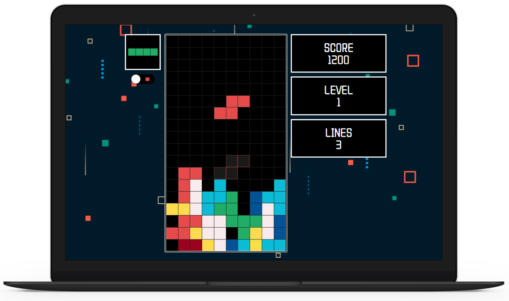
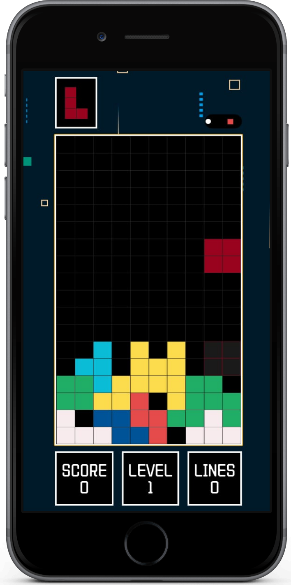
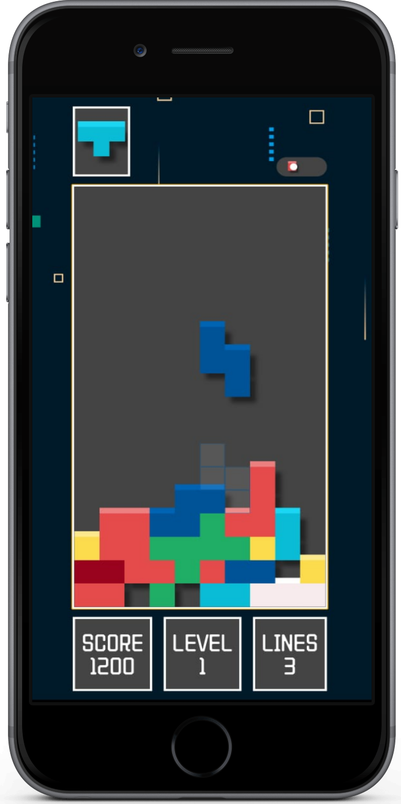

# React Tetris

> Fully responsive tetris game built with ReactJS

	  
	  
	  
	  
	  

<h1 align="center">
  
  
  
</h1>

## Overview

This repository contains project code and supporting assets. It is maintained actively with periodic updates.

## Getting Started

1. Clone this repository.
2. Install dependencies as documented in the project files.
3. Run/build using the project-specific commands.

## Repository Structure

Key source code, configuration, and documentation are organized by folders at the repository root.

## Contribution Guidelines

Please open an issue for major changes and submit focused pull requests with clear descriptions.
